# Weather-App-Shinyapps

### This is a repository that guides how to deploy a weather app on [Shinyapps.io](https://www.shinyapps.io/). 
### The app provides current weather information and forecasts for the next five days.

### The app will appear as follows:

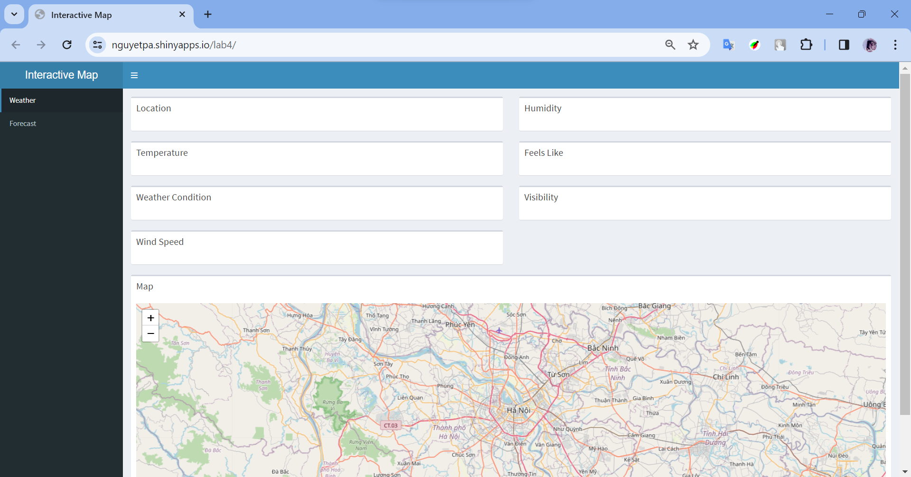
### Steps to use the app:
- Find the location you want to view on the map and use the mouse to hover over it.
- In the tab named 'Weather,' it will display weather information at that location, including: Location, Humidity, Temperature, Feels Like, Weather Condition, Visibility, Wind Speed.
- 
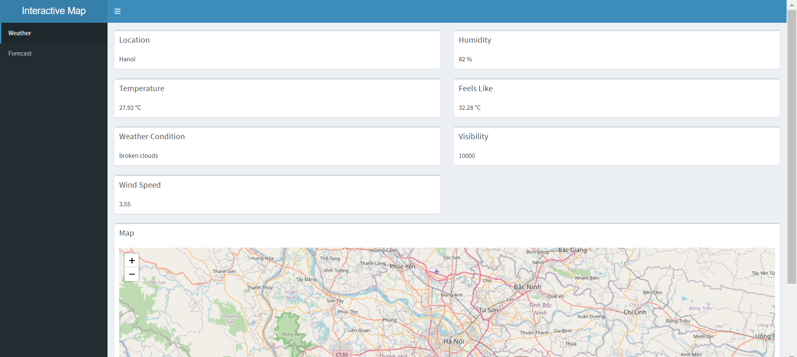
- In the 'Forecast' tab, a Line chart will display the weather forecast for the selected location for the next 5 days, including information about temperature (temp), feels_like, temp_min, temp_max, pressure, sea_level, grnd_level (ground level), humidity, speed, deg, gust.
- 
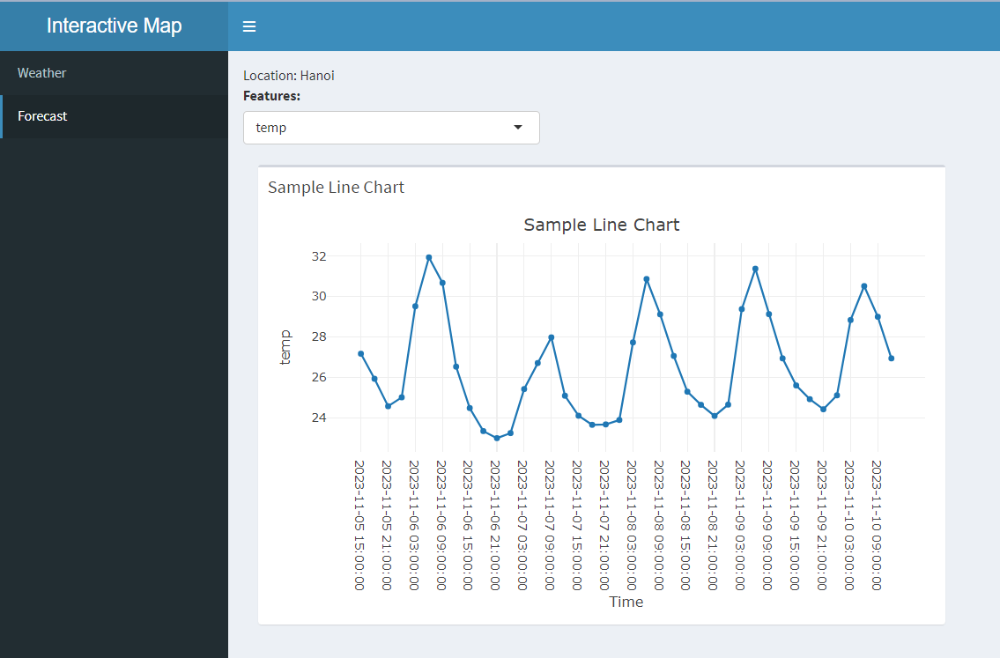

### Step 1: Get API Keys for Weather information
- Go to [Open Weather Map](https://openweathermap.org/api) and sign in (or sign up if you do not have any account).
- Get API Keys
  
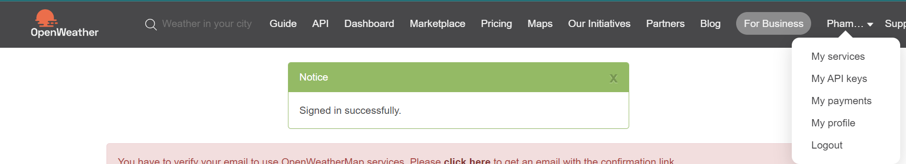

### Step 2: Code R get information about weather by API_keys
Note: Use RStudio to code this app. Link to download [here](https://posit.co/download/rstudio-desktop/).
Go to [app.R](app.R) and see the functions which I built carefully:
- **get_weather_info**: to get the information of weather .
- **get_forecast**: to get the forecast of weather in specific location within 5 days.
- **ui**: to set up the UI for your app. It contains 2 tabnames: Weather & Forecast.
- **server**: process the logic to display your app.

*If you want to test your app in localhost, you can click on RunApp (recommend choose Run in Viewer Panel mode)*

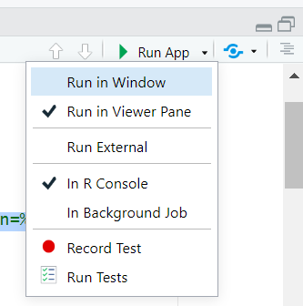

### Step 3: Deploy your app on Shinyapps.io
- Create an account on [Shinyapps.io](https://www.shinyapps.io/)
- Click on "Tokens"
  
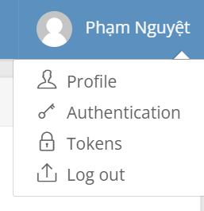
- Click on "Show" -> "Show Secret" -> "Copy to Clipboard"
  
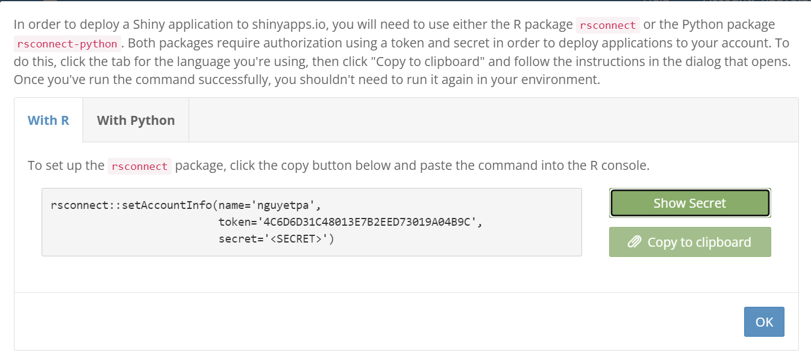
- Click on the publish icon (which is right of RunApp icon) and choose "Clear List" (if necessary)
  
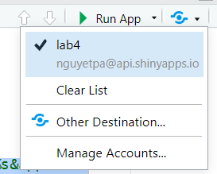
- Choose "Publish Application..."
  
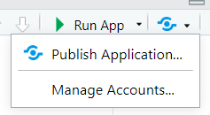
- Add account by clicking on "Add New Account" -> "ShinyApps.io" -> paste Token -> "Connect Account"
  
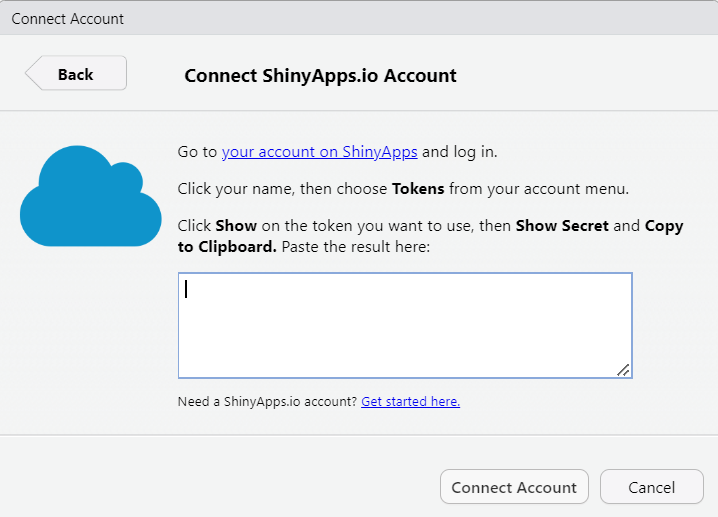
- Choose all files and set title name
  
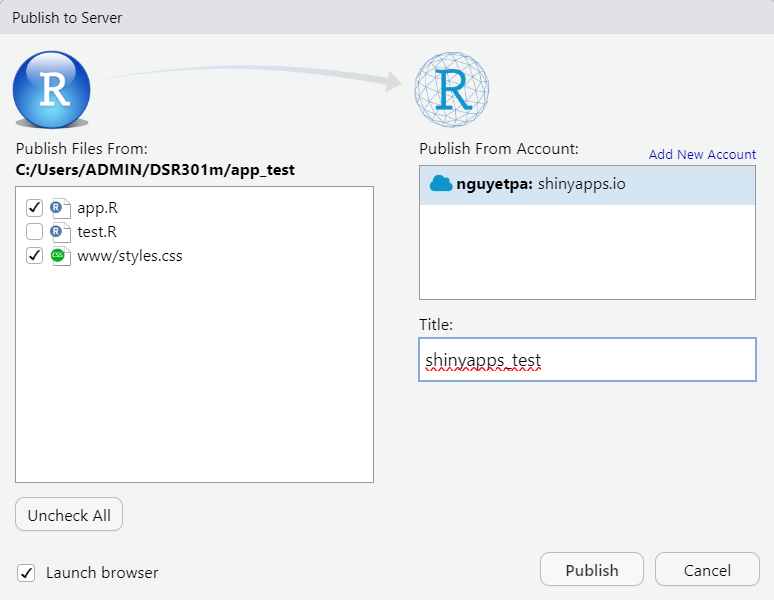
- Click on "Publish" and wait to deploy!!!
- As soon as finish the deployment, on the Shinyapps.io, you can see your app here.
  
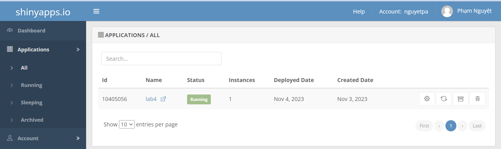
- Click on the URL which is hidden in "Name" you can see in above image (e.g: "lab4"), this is information about the app.
  
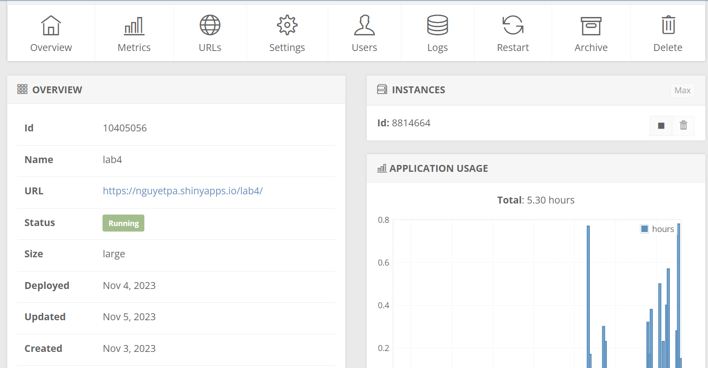

You can explore more by yourself!!!

*Thanks for reading!!! Have a nice day!!!*
*Author: [Pham Nguyet](https://github.com/phamnguyet2003)*
